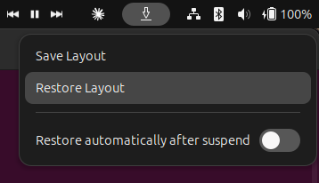

# Save My Windows (JuGuSm fork)

This is a personal fork of [lukastymo/save-my-windows](https://github.com/lukastymo/save-my-windows), a GNOME Shell extension
that works well on Wayland and helps with multi-monitor, multi-workspace setups, since window positions get messed up after
each suspend.

The upstream project is [archived](https://github.com/lukastymo/save-my-windows) — the author considers it no longer
necessary since GNOME on Wayland now restores window layouts correctly after suspend/resume. This fork keeps using it and
adds personal changes on top (see below), under the UUID `save-my-windows@JuGuSm` so it can be installed alongside the
original without conflicting.



Save My Windows periodically records all open windows along with their monitors and workspaces.
It lets you restore your window layout whenever Wayland resets or scrambles positions (e.g. after suspend).

## What's different in this fork

- Renamed (UUID, config directory, panel identifier) to `save-my-windows@JuGuSm` so it doesn't collide with an install of
  the original extension.
- Window titles saved in `layout.json` can now be regex patterns instead of exact text, so restoration keeps matching a
  window even if its title changes (browser tab title, open file name, etc). See below.

## Window title pattern matching

When restoring a layout, each saved window entry is matched against currently open windows using its `wm_class` and
`title`. By default `title` must match **exactly**, same as upstream.

To match by pattern instead, prefix the saved `title` with `re:` — the rest of the string is compiled as a JavaScript
regular expression and tested against the live window's title:

```json
{
  "title": "re:^Firefox",
  "wm_class": "firefox",
  "workspace": 0,
  "monitor": 0,
  "x": 0, "y": 0, "width": 1280, "height": 800
}
```

This matches any Firefox window whose title starts with "Firefox", regardless of the active tab.

Examples:

| `title` in `layout.json` | Behavior |
|---|---|
| `"Firefox — Mozilla Firefox"` | Exact match only (default, unchanged from upstream) |
| `"re:^Firefox"` | Matches any title starting with "Firefox" |
| `"re:.*\\.txt — gedit"` | Matches any `.txt` file open in gedit, regardless of filename |

Notes:
- Entries without the `re:` prefix are unaffected — existing `layout.json` files keep working exactly as before.
- If the text after `re:` is not a valid regular expression, the entry is logged as an error and skipped (that window
  won't be restored), rather than crashing the extension.
- Matching is still evaluated per saved entry independently, so a broad pattern can in principle match more than one
  currently open window (same limitation as an exact-title match on two windows sharing the same title).

## Installation

### Manually (this fork is not published on extensions.gnome.org)

```bash
./install.sh
```

This installs to `~/.local/share/gnome-shell/extensions/save-my-windows@JuGuSm/` and enables the extension. Reload GNOME
Shell afterwards (see below) to pick it up.

## Reloading GNOME Shell after changes

- **X11**: press `Alt+F2`, type `r`, press Enter. Restarts GNOME Shell without logging out.
- **Wayland**: GNOME Shell cannot be restarted in place; log out and back in for changes to take effect.

# Dev notes

### Releasing a new version

- Bump `version` in `metadata.json`
- Run `./release.sh` to tag the release
- Run `./pack.sh` to build the zip if you want to distribute it manually

## License

This extension is released under the GNU Public License version 3.
